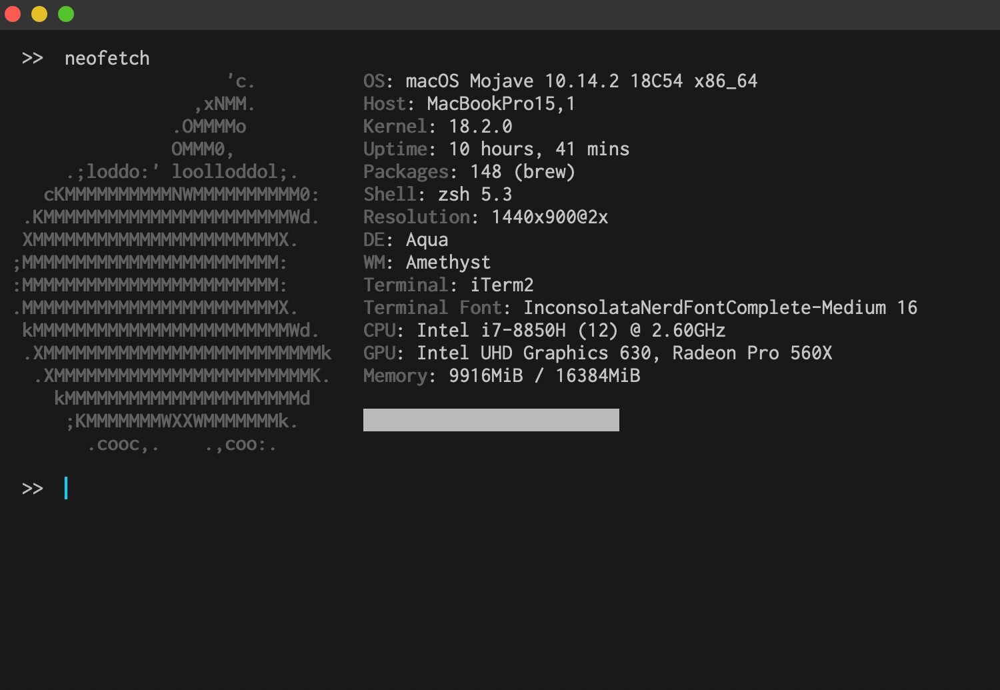

# Gray Matter for iTerm2

A port of the brilliant [Gray Matter](https://github.com/philipbelesky/gray-matter) color schemes by @philipbelesky for iTerm2

## Light Theme

- Coming soon.

## Dark Theme

## How to install

1. Launch iTerm2.
2. Go to `Preferences`.
3. Choose `Profiles`.
4. Go to  `Colors` tab.
5. Click on `Color Presets`.
6. Choose `Import...`.
7. Select `Gray Matter Light.itermcolors` or `Gray Matter Dark.itermcolors`.
8. Click on `Color Presets` again and choose `Gray Matter Light` or `Gray Matter Dark`.

## Todo

- [x] Gray Matter Dark
- [ ] Gray Matter Light

## License

The MIT License

## Acknowledgements

Thanks to @philipbelesky as the original creator of [Gray Matter](https://github.com/philipbelesky/gray-matter)
